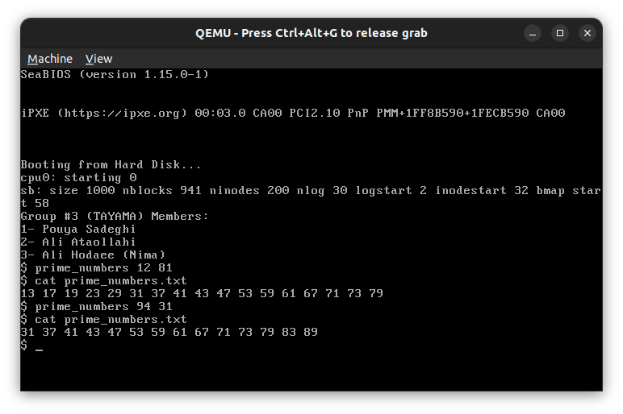

# os-project1
## installation
### install dependencies
```shell
sudo apt install qemu
```
```shell
sudo apt install qemu-install-x86
```
### run xv6
**Attention** make sure you are in codes/xv6 directory

```shell
make
```
```shell
make qemu 
```
or if you want to run in current terminal:
```shell
make qemu-nox
```

## clean generated files:
```shell
make clean
```
***
## boot xv6


***
## run and test user level app
