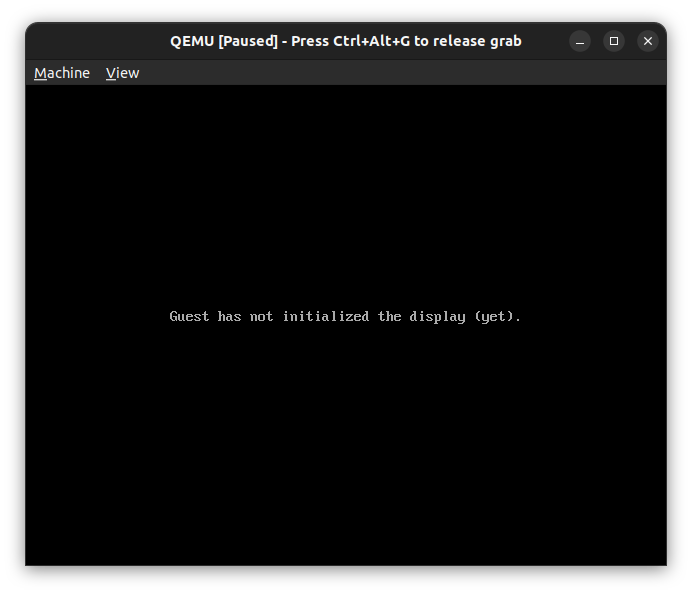
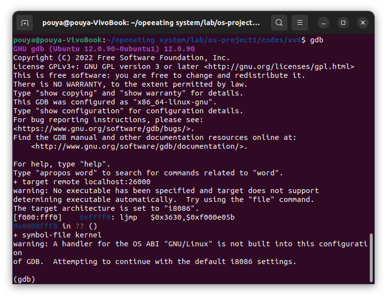
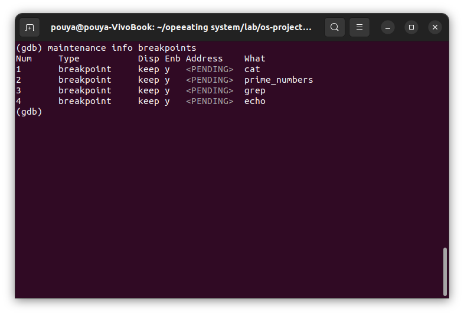

# troubleshooting with gdb
## start debug

first, you need to install gdb. on ubuntu, you can do this with:
```shell
sudo apt-get install gdb
```
then, run:
```shell
make qemu-gdb
```
or
```shell
make qemu-nox-gdb
```
if you want to run in current terminal.


now, you can connect to qemu with gdb, in another terminal, run:
```shell
gdb
```


for connecting debugger, you may need to run:
```shell
target remote localhost:26000
```
***
## breakpoints
### to list breakpoints
```shell
maintenance info breakpoints 
```
or 
```shell
maint info breakpoints
```
or
```shell
info breakpoints
```
or just
```shell
i b
```

### to set breakpoint
add by function name:
```shell
break [function name]
```
add by line number:
```shell
break [file name]:[line number]
```
add by address:
```shell
break *0x[address]
```
### to delete breakpoint
if you want to delete breakpoint by number(you can see it in `info breakpoints`):
```shell
```shell
delete [breakpoint number]
```
if you want to delete breakpoint by function name:
```shell
delete [function name]
```
if you want to delete breakpoint by line number:
```shell
delete [file name]:[line number]
```
if you want to delete breakpoint by address:
```shell
delete *0x[address]
```
***
## run
### to run
```shell
continue
```
### to run until breakpoint
```shell
until
```
### to run until function return
```shell
finish
```
***
## step
### to step
```shell
step
```
### to step over
```shell
next
```
***
## print value of a variable
### to print value of variable
```shell
print [variable name]
```
### to print value of variable in hex
```shell
print/x [variable name]
```
### to print value of variable in binary
```shell
print/b [variable name]
```
### to print value of variable in decimal
```shell
print/d [variable name]
```
### to print value of variable in octal
```shell
print/o [variable name]
```
### to print value of variable in string
```shell
print/s [variable name]
```
***
## watch
### to watch variable
```shell
watch [variable name]
```
### to watch variable in hex
```shell
watch/x [variable name]
```
### to watch variable in binary
```shell
watch/b [variable name]
```
### to watch variable in decimal
```shell
watch/d [variable name]
```
### to watch variable in octal
```shell
watch/o [variable name]
```
### to watch variable in string
```shell
watch/s [variable name]
```
***
## backtrace
### to print backtrace
```shell
backtrace
```
or
```shell
bt
```
***
## disassemble
### to disassemble
```shell
disassemble
```
or
```shell
disas
```
### to disassemble function
```shell
disassemble [function name]
```
or
```shell
disas [function name]
```