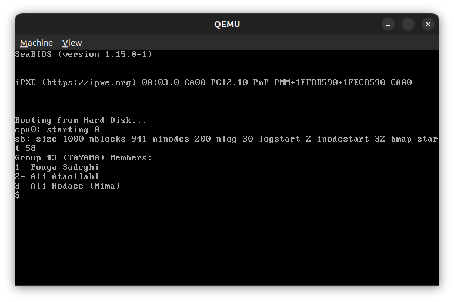
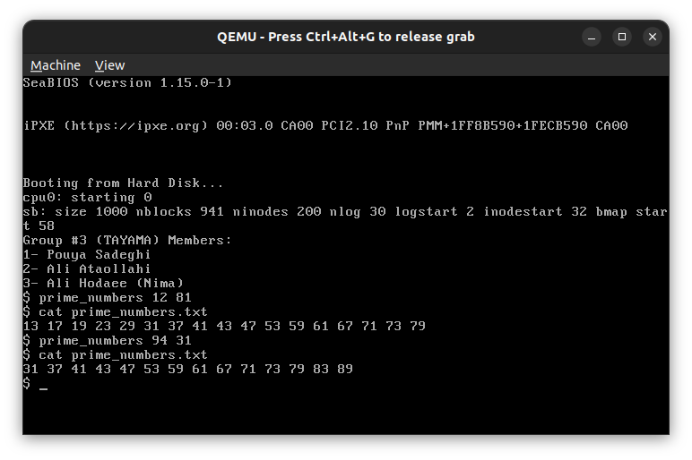

# os-project1
## installation
### install dependencies
```shell
sudo apt install qemu
```
```shell
sudo apt install qemu-install-x86
```
### run xv6
**Attention** make sure you are in codes/xv6 directory

```shell
make
```
```shell
make qemu 
```

or if you want to run in current terminal:
```shell
make qemu-nox
```

## clean generated files:
```shell
make clean
```
***
## run and test user level app


***
## debug xv6
for information about debugging with ```gdb```  see [troubleshooting](troubleshooting.md) section.
***
## how xv6 works
### how can ```xv6``` get inout to the console?